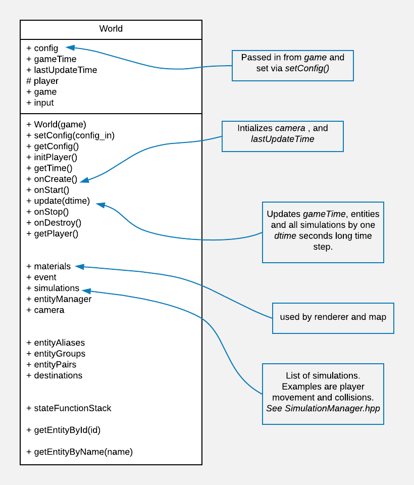

# Diagrams
Diagrams for Design and Data Models

[Config], [Config]->[Game], [MapLoader{bg:orange}]<-[World], [ScreenLoader{bg:orange}]<-[World], [World]<-[Game], [Game]->[Renderer{bg:blue}]], [Renderer{bg:blue}]->[SubRenderer{bg:blue}], [SubRenderer{bg:blue}]->[ScreenRenderer{bg:blue}], [SubRenderer{bg:blue}]->[TextRenderer{bg:blue}], [SubRenderer{bg:blue}]->[PortalRenderer{bg:blue}]]" >

The following is a high level overivew of the World class and what it does.

